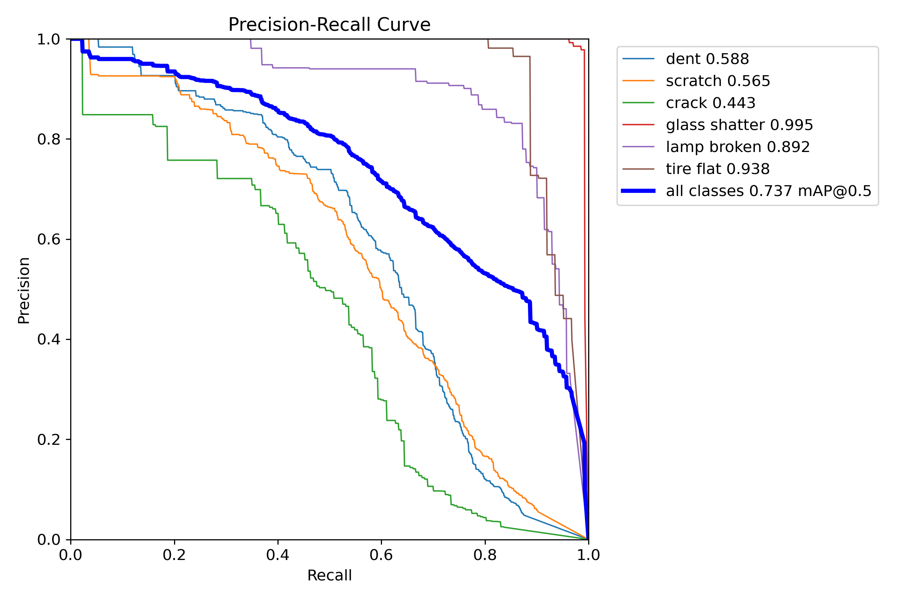
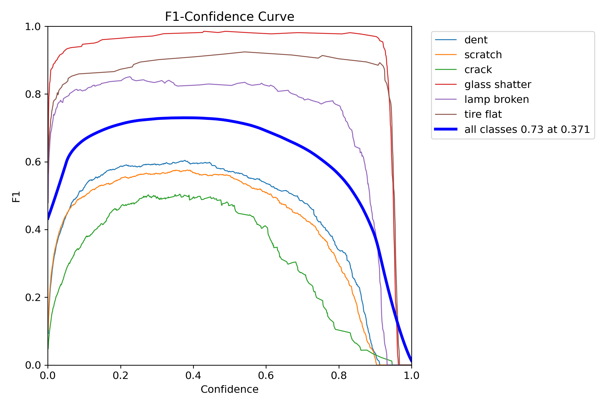

# Car Damage Detection System

Automated vehicle damage detection and localization using **YOLOv11m** with transfer learning from COCO pretrained weights.

Trained on the [CarDD dataset](https://cardd-ustc.github.io/) — 4,000 real-world car damage images across 6 damage types.

---

## Results

### Final Model Performance (100 epochs)

| Metric | Score |
|--------|-------|
| **mAP50** | **0.737** |
| **mAP50-95** | **0.577** |
| Precision | 0.776 |
| Recall | 0.695 |

### Training Curves

Training and validation metrics over 100 epochs:


### Precision-Recall Curve



### F1-Confidence Curve



### Confusion Matrix

How the model classifies each damage type (normalized):


### Validation Predictions

Model predictions on validation images (images the model has **never trained on**, only used to measure performance during training):


Ground truth labels for comparison:


### Class Distribution

Distribution of annotations across the 6 damage classes in the dataset:


---

## Dataset — CarDD (Car Damage Detection)

The [CarDD dataset](https://cardd-ustc.github.io/) contains 4,000 images with 9,740 bounding box annotations across 6 damage categories.

### Data Splits

| Split | Images | Purpose |
|-------|--------|---------|
| **Train** | 2,816 | Model learns from these images (with augmentations) |
| **Validation** | 810 | Evaluated after each epoch to track performance and prevent overfitting — the model **never trains** on these |
| **Test** | 374 | Final held-out evaluation — the model **never sees** these during training or validation |

### Damage Classes (6 total)

| Class | Train Annotations | Description |
|-------|-------------------|-------------|
| scratch | 3,595 | Surface scratches on body panels |
| dent | 2,543 | Dents and deformations |
| crack | 898 | Cracks in body/bumper |
| lamp broken | 704 | Broken headlights/taillights |
| glass shatter | 681 | Shattered windows/windshields |
| tire flat | 319 | Flat or damaged tires |

> **Note:** The dataset is imbalanced — scratches have 11x more annotations than tire flats. This is reflected in the per-class detection performance.

---

## Quick Start

### 1. Setup

```bash
python -m venv venv
venv\Scripts\activate        # Windows
# source venv/bin/activate   # Linux/Mac
pip install -r requirements.txt
```

### 2. Prepare Dataset

Download the [CarDD dataset](https://cardd-ustc.github.io/) and place it in `CarDD_release/`, then convert to YOLO format:

```bash
python prepare_all_classes.py
```

This creates `CarDD_YOLO_6classes/` with the proper train/val/test splits in YOLO format.

### 3. Train

```bash
python train_yolo11_all_classes.py
```

Edit the top of the script to configure:
- `MODE = 'fresh'` — start from scratch with COCO pretrained weights
- `MODE = 'continue'` — fine-tune from your existing `best.pt` (uses lower learning rate)
- `EPOCHS = 100` — number of training epochs

### 4. Evaluate on Test Set

```bash
python scripts/evaluate_model.py
```

Runs the trained model on the **test** split (374 images the model has never seen).

### 5. Run Inference on New Images

```bash
python scripts/inference.py car_image.jpg
python scripts/inference.py car_photos/ --batch
python scripts/inference.py car_image.jpg --conf 0.5
```

Or use directly in Python:

```python
from ultralytics import YOLO

model = YOLO('runs/detect/yolo11m_cardd_6classes/weights/best.pt')
results = model('car_image.jpg', conf=0.25)
results[0].show()
```

---

## Training Configuration

| Parameter | Value | Notes |
|-----------|-------|-------|
| Model | YOLOv11m | 20M parameters, COCO pretrained |
| Image size | 640px | Standard YOLO input |
| Batch size | 8 | Fits in 6GB VRAM |
| Optimizer | SGD | lr=0.01 (fresh), lr=0.001 (continue) |
| Epochs | 100 | With early stopping patience=100 |
| GPU | RTX 3060 6GB | ~2 min/epoch |

### Augmentations

| Augmentation | Value | Description |
|-------------|-------|-------------|
| Mosaic | 0.5 | Combines 4 images into one (50% probability) |
| Horizontal flip | 0.5 | Left-right flip (50% probability) |
| Rotation | +/-15 deg | Random rotation |
| Translation | 0.2 | Random shift up to 20% |
| Scale | 0.5 | Random zoom 50%-150% |

> Augmentations are applied to the **training** images only. Validation and test images are evaluated without any augmentation.

---

## Project Structure

```
train_yolo11_all_classes.py         # Main training script (fresh / continue modes)
prepare_all_classes.py              # Convert CarDD dataset to YOLO format
requirements.txt                    # Python dependencies

scripts/
    evaluate_model.py               # Evaluate model on test/val set
    inference.py                    # Run detection on new images
    visualize_results.py            # Prediction vs ground truth visualizations
    plot_results.py                 # Plot training curves from results.csv
    dataset_loader.py               # Dataset loading utilities

results/                            # Training output images (for this README)
    training_curves/                # Loss curves, mAP, PR, F1 plots
    confusion_matrix/               # Confusion matrices
    validation_predictions/         # Model predictions on validation images
    class_distribution/             # Dataset class distribution

runs/detect/yolo11m_cardd_6classes/ # Full training output (gitignored)
    weights/best.pt                 # Best model weights
    weights/last.pt                 # Last epoch weights
    results.csv                     # Per-epoch metrics
    results.png                     # Training curves

docs/                               # Technical documentation
    TRAINING_PROCESS_EXPLAINED.md   # How YOLO training works
    TRANSFER_LEARNING_EXPLAINED.md  # Transfer learning concepts
    MODEL_COMPARISON.md             # YOLO model size comparison
    YOLO_VERSION_COMPARISON.md      # YOLOv8 vs YOLOv11
```

---

## How Training, Validation, and Test Work

| Phase | Data Used | When | Purpose |
|-------|-----------|------|---------|
| **Training** | 2,816 images (with augmentation) | Every epoch | Model learns to detect damage by adjusting weights |
| **Validation** | 810 images (no augmentation) | After each epoch | Monitors performance to detect overfitting. The best model is saved based on validation mAP |
| **Test** | 374 images (no augmentation) | After training is done | Final unbiased evaluation on completely unseen data |

- The model **only learns** from training images
- Validation images are used to pick the best checkpoint — they are **not** used for training
- Test images are a fully held-out set — used **only once** for final evaluation

---

## Requirements

- Python 3.8+
- NVIDIA GPU with CUDA support
- 6GB+ VRAM (tested on RTX 3060 Laptop GPU)

```bash
pip install -r requirements.txt
```

---

## Acknowledgments

- [Ultralytics](https://github.com/ultralytics/ultralytics) — YOLOv11 framework
- [CarDD Dataset](https://cardd-ustc.github.io/) — Car Damage Detection Dataset (Wang et al.)
