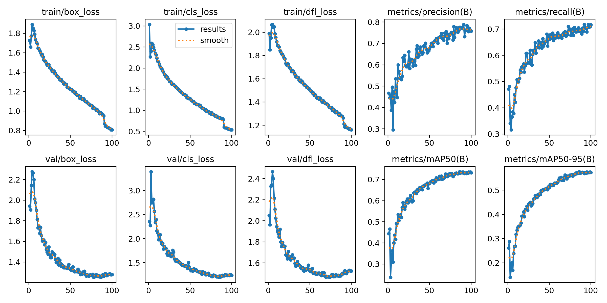
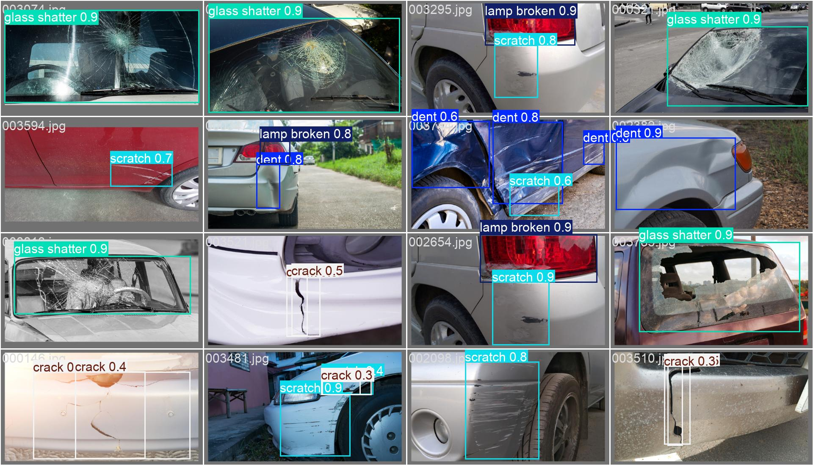
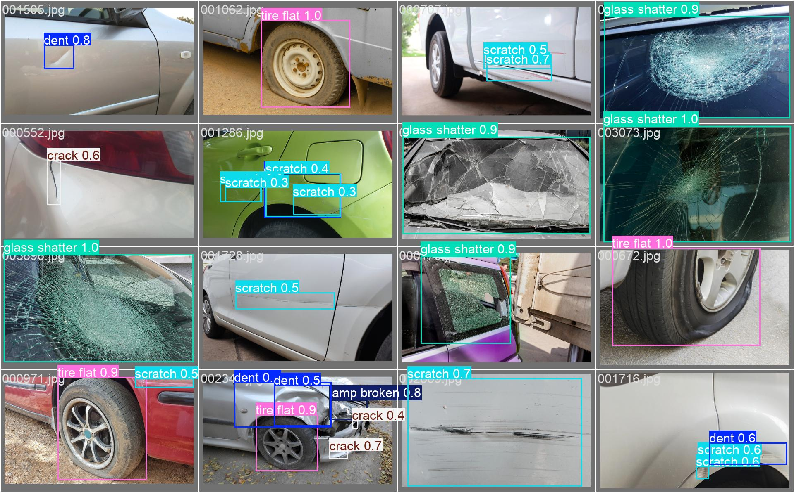
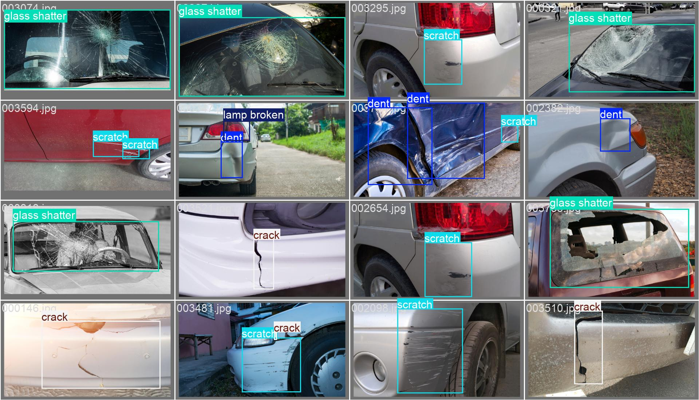
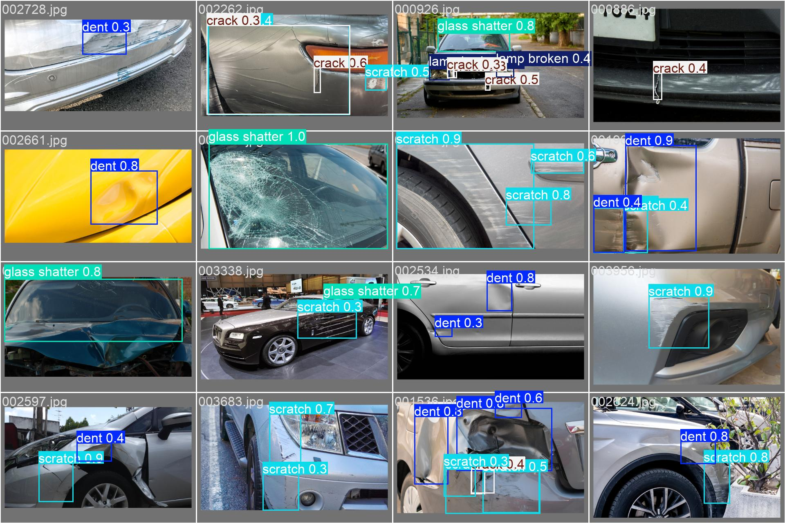
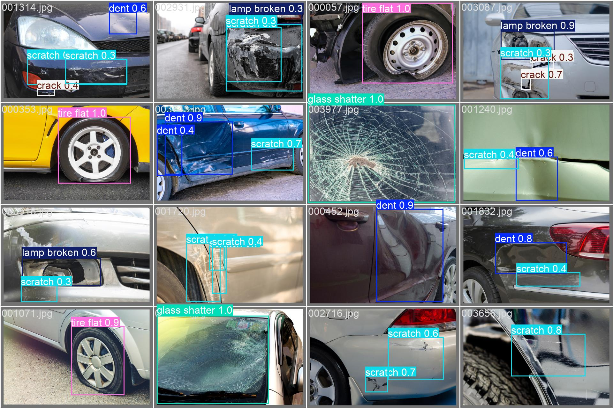
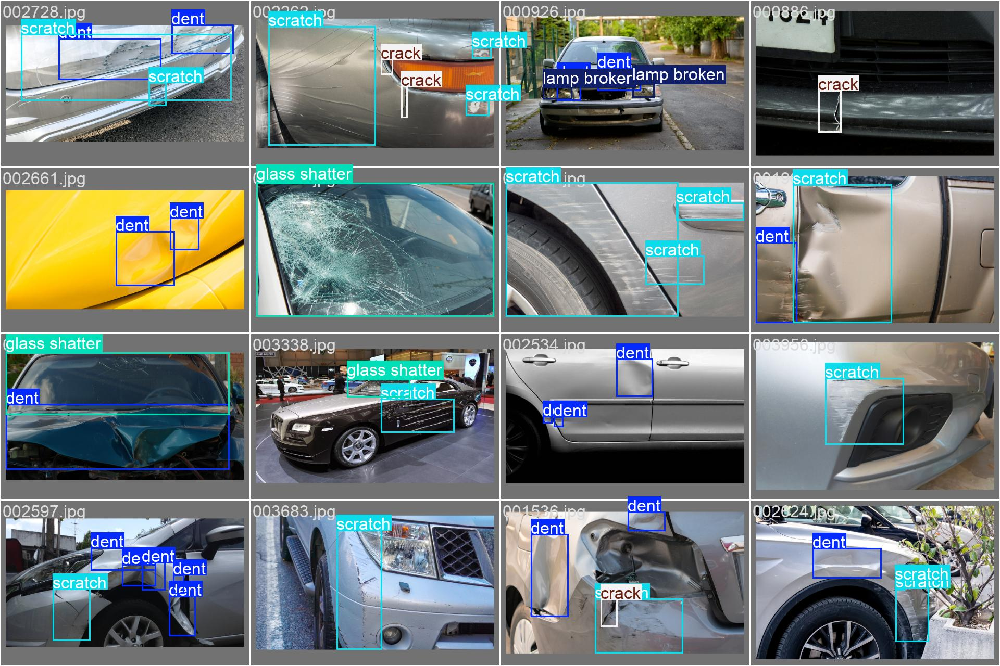
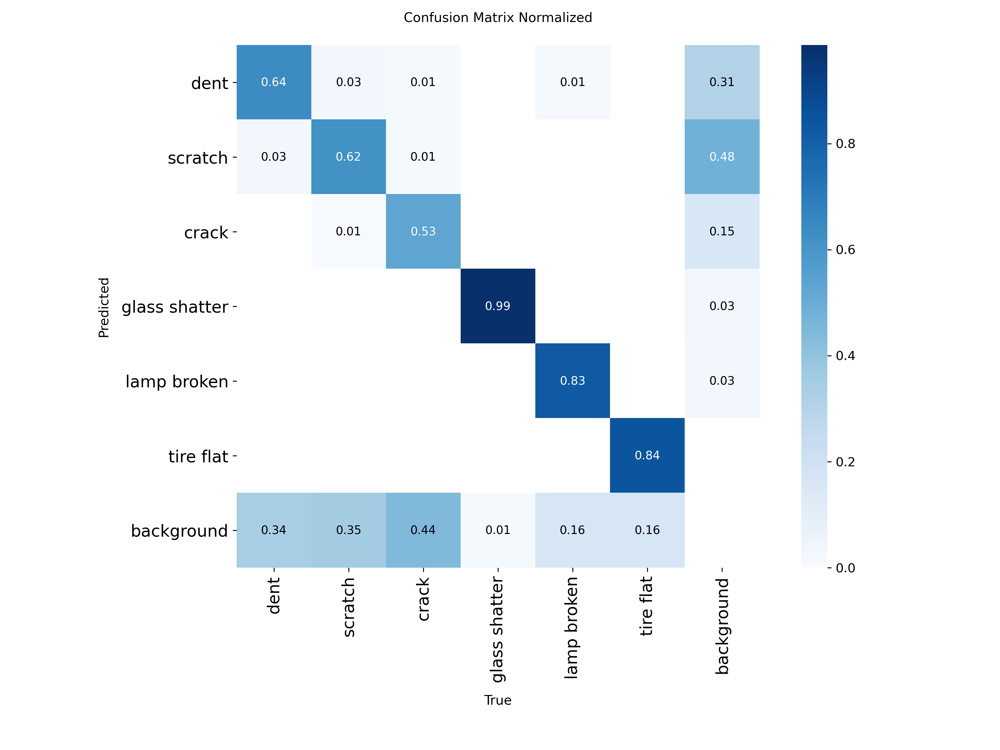
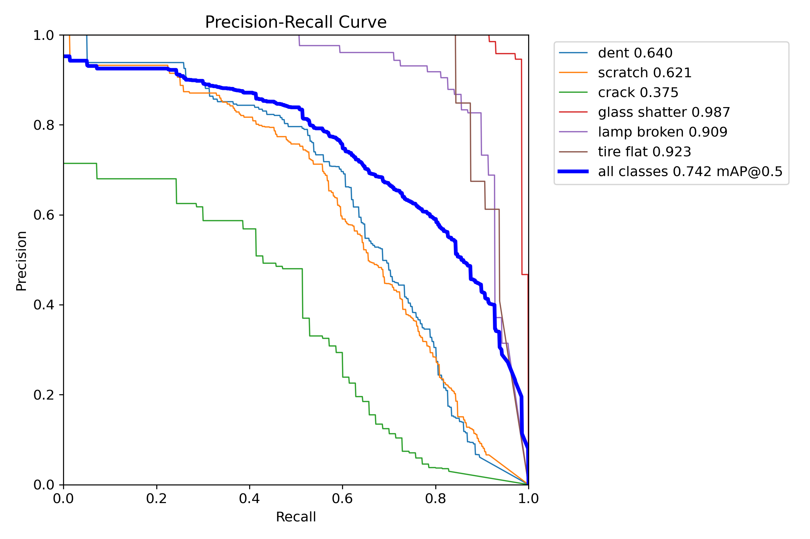
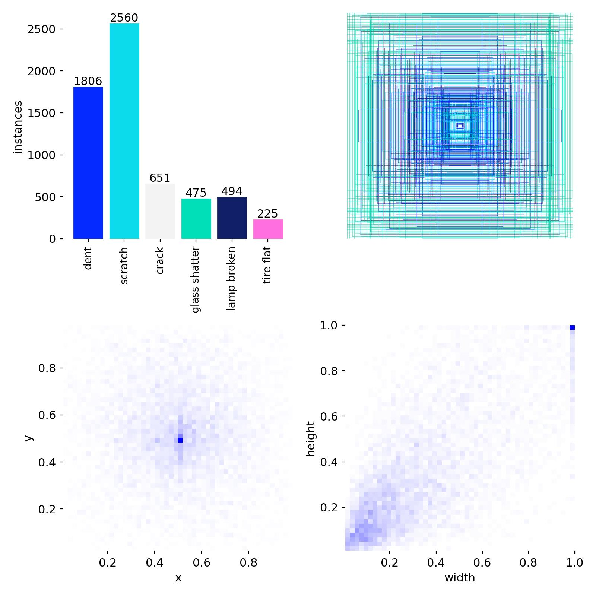

# Car Damage Detection & Assessment System

End-to-end pipeline for detecting, classifying, and estimating repair costs for vehicle damage.

**Image in → PDF report out.**

```
Input Image → YOLO Detection → CLIP Severity & Location → Cost Estimation → PDF Report
```

Built with **YOLOv11m** (object detection), **CLIP** (zero-shot severity/location classification), and **fpdf2** (report generation). Trained on the [CarDD dataset](https://cardd-ustc.github.io/) — 4,000 real-world car damage images across 6 damage types.

---

## Full Pipeline

```bash
# Single image → PDF report + JSON
python scripts/full_pipeline.py car_photo.jpg

# Batch mode — all images in a folder
python scripts/full_pipeline.py car_photos/ --batch

# Custom confidence threshold
python scripts/full_pipeline.py car_photo.jpg --conf 0.5
```

### Pipeline Flow

```
Input Image
    │
    ▼
Step 1: YOLO Detection
    → bounding boxes + damage type + confidence
    │
    ▼ (for each detection)
Step 2: Crop damage region (with 15% padding for context)
    │
    ├─ Step 3a: CLIP Severity (on CROP)
    │  Compares crop against text prompts like
    │  "a deep scratch exposing bare metal"
    │  → minor / moderate / severe
    │
    ├─ Step 3b: CLIP Location (on FULL IMAGE)
    │  Sends full image with red rectangle highlighting
    │  the damage bbox → hood / door / bumper / etc.
    │
    └─ Step 4: Cost Estimation
       Lookup table: (damage_type + severity) → price range
       → e.g. moderate scratch → $200-$800
    │
    ▼
Step 5: PDF Report
    → annotated image + summary table + per-damage details + total cost
```

### Demo Reports

Pipeline output on test images (images the model has **never seen** during training):

| Image | Damages Found | Assessment | Total Cost |
|-------|--------------|------------|------------|
| 000088 | 2 — crack + scratch | crack: minor, fender / scratch: moderate, fender | $300 - $1,100 |
| 000320 | 1 — glass shatter | severe, windshield (83% confidence) | $400 - $1,500 |
| 000848 | 4 — scratch + 3 dents | scratch: moderate / dents: moderate-severe, rear | $1,700 - $6,300 |

Generated PDF reports are saved in the [`reports/`](reports/) directory.

---

## YOLO Detection Results

### Validation Set Performance (100 epochs)

The best model checkpoint is selected based on **validation mAP** — the highest mAP50 achieved during training:

| Metric | Validation | Test |
|--------|-----------|------|
| **mAP50** | **0.737** | **0.742** |
| **mAP50-95** | **0.577** | **0.575** |
| Precision | 0.776 | 0.781 |
| Recall | 0.695 | 0.697 |

Validation and test scores are very close, confirming the model generalizes well and is not overfitting.

### Test Set Performance (per-class)

| Class | mAP50 | Precision | Recall | Notes |
|-------|-------|-----------|--------|-------|
| glass shatter | 0.987 | 0.912 | 0.986 | Best — visually distinctive |
| tire flat | 0.923 | 0.969 | 0.844 | Strong — unique shape |
| lamp broken | 0.909 | 0.921 | 0.783 | Strong — clear visual pattern |
| dent | 0.640 | 0.706 | 0.585 | Harder — subtle deformations |
| scratch | 0.621 | 0.679 | 0.567 | Harder — fine surface marks |
| crack | 0.375 | 0.501 | 0.417 | Hardest — rare + subtle |

> Classes with distinctive visual features (shattered glass, flat tires) are detected reliably. Subtle damage types (scratches, cracks) are harder — they depend on lighting, angle, and image resolution.

### Confidence Threshold Selection

We use a confidence threshold of **0.35** for the pipeline (default YOLO is 0.25).

**How was this chosen?** By looking at the validation set's F1-Confidence curve. The F1 score balances precision and recall — too low a threshold gives many false positives, too high misses real damages. The F1 curve peaks around 0.35-0.40 for most classes, so 0.35 is a good balance:

- **Lower (0.25):** More detections, but includes low-confidence predictions that may be false positives
- **0.35 (chosen):** Best F1 tradeoff — catches most real damages while filtering out noise
- **Higher (0.50):** Fewer false positives, but misses some real damages (lower recall)

The threshold was selected from the **validation set** (not test set) to avoid data leakage. The test set is only used for final evaluation.

### Training Curves

Training and validation metrics over 100 epochs:



### Validation Predictions

Model predictions on validation images (used to track performance during training — **never trained on**):





Ground truth labels for comparison:



### Test Set Predictions

Model predictions on the held-out **test set** (never seen during training or validation):





Ground truth for comparison:



### Test Set Confusion Matrix



### Test Set PR Curve



### Training Confusion Matrix


### Class Distribution

Distribution of annotations across the 6 damage classes in the dataset:



---

## Dataset — CarDD (Car Damage Detection)

The [CarDD dataset](https://cardd-ustc.github.io/) contains 4,000 images with 9,740 bounding box annotations across 6 damage categories.

### Data Splits

| Split | Images | Purpose |
|-------|--------|---------|
| **Train** | 2,816 | Model learns from these images (with augmentations) |
| **Validation** | 810 | Evaluated after each epoch to track performance and prevent overfitting — the model **never trains** on these |
| **Test** | 374 | Final held-out evaluation — the model **never sees** these during training or validation |

### Damage Classes (6 total)

| Class | Train Annotations | Description |
|-------|-------------------|-------------|
| scratch | 3,595 | Surface scratches on body panels |
| dent | 2,543 | Dents and deformations |
| crack | 898 | Cracks in body/bumper |
| lamp broken | 704 | Broken headlights/taillights |
| glass shatter | 681 | Shattered windows/windshields |
| tire flat | 319 | Flat or damaged tires |

> **Note:** The dataset is imbalanced — scratches have 11x more annotations than tire flats. This is reflected in the per-class detection performance.

---

## How Training, Validation, and Test Work

| Phase | Data Used | When | Purpose |
|-------|-----------|------|---------|
| **Training** | 2,816 images (with augmentation) | Every epoch | Model learns to detect damage by adjusting weights |
| **Validation** | 810 images (no augmentation) | After each epoch | Monitors performance to detect overfitting. The best model is saved based on validation mAP |
| **Test** | 374 images (no augmentation) | After training is done | Final unbiased evaluation on completely unseen data |

- The model **only learns** from training images
- Validation images are used to pick the best checkpoint and tune the confidence threshold — they are **not** used for training
- Test images are a fully held-out set — used **only once** for final evaluation

---

## Damage Assessment Pipeline (CLIP-based)

Beyond detection, the system uses **CLIP (Contrastive Language-Image Pretraining)** to assess each detected damage — classifying its **severity** and **car panel location** without any additional training.

### How CLIP Works Here

CLIP is a vision-language model from OpenAI. It takes an image and a list of text descriptions, and scores how well each text matches the image. We use this for **zero-shot classification** — no training needed.

**Severity classification** (uses the **cropped** damage region):
- For each damage type, we have 3 text prompts describing minor/moderate/severe
- Example for scratch: "a photo of a light surface scratch, paint still intact" vs "a photo of a deep scratch exposing bare metal"
- CLIP scores all 3 and picks the best match
- We use the **crop** (not full image) so CLIP sees the damage up close — depth, texture, material exposure

**Location classification** (uses the **full image** with red rectangle):
- We draw a red rectangle on the full car image around the bounding box
- CLIP compares against 17 location prompts: "damage on a car hood", "damage on a car front door", etc.
- We use the **full image** (not crop) because a crop loses spatial context — you can't tell if a scratched surface is a hood or a door without seeing the whole car

### Why CLIP? Alternatives Considered

| Approach | Accuracy | Speed | Effort | Cost | Offline |
|----------|----------|-------|--------|------|---------|
| **CLIP Zero-Shot (chosen)** | Moderate (~50-70% conf.) | Medium | Very low | Free | Yes |
| Custom CNN Classifier | High (80-90%+) | Fast | High (needs labeled data) | Free | Yes |
| Rule-Based (bbox size) | Low | Very fast | Low | Free | Yes |
| Fine-Tuned CLIP | High | Medium | Medium (needs some labels) | Free | Yes |
| LLM Vision API (GPT-4V) | Very high | Slow | Very low | $$$ per image | No |

**Advantages of our approach (CLIP zero-shot):**
- No training or fine-tuning needed — works out of the box
- No labeled severity data required (the CarDD dataset has no severity annotations)
- Easy to modify — changing classification categories only requires editing text prompts
- Runs locally, no API costs, no internet required

**Disadvantages of our approach:**
- Moderate confidence scores (~50-70%) — CLIP is a general-purpose model, not specialized for car damage
- Severity is subjective — there is no ground truth to validate against
- Location accuracy depends on how much of the car is visible in the image
- Slower than a small custom CNN (CLIP is a large model)
- Results depend heavily on prompt wording — different prompts can give different results

### Cost Estimation

A lookup table maps (damage_type + severity) to an estimated USD repair cost range:

| Damage Type | Minor | Moderate | Severe |
|------------|-------|----------|--------|
| Scratch | $50-$200 (buffing) | $200-$800 (touch-up/respray) | $800-$2,500 (full repaint) |
| Dent | $75-$250 (PDR) | $250-$1,000 (filler+repaint) | $1,000-$3,500 (panel replace) |
| Crack | $100-$300 (filler) | $300-$1,200 (partial repair) | $1,200-$4,000 (panel replace) |
| Glass shatter | $50-$150 (chip repair) | $200-$600 (aftermarket) | $400-$1,500 (OEM replace) |
| Lamp broken | $50-$200 (lens repair) | $150-$500 (aftermarket) | $300-$1,500 (OEM assembly) |
| Tire flat | $20-$50 (patch/plug) | $100-$300 (tire replace) | $200-$800 (tire+rim) |

> These are approximate US market averages. Actual costs depend on vehicle make/model, location, parts availability, and shop rates.

### Known Limitations

- **Text prompt max length is 77 tokens** — CLIP truncates anything longer. Our prompts are ~12 tokens so this is not an issue, but it limits how descriptive prompts can be.
- **Image gets resized to 224x224** — CLIP's input resolution is fixed. A tiny scratch in a large image may lose detail after resizing. This is why we crop first — the crop gets resized to 224x224 so the damage fills the frame.
- **No ground truth for severity** — the CarDD dataset does not include severity labels, so there is no way to objectively measure severity accuracy. Results are based on CLIP's visual judgment.
- **Single-image analysis only** — each image is analyzed independently. The system cannot combine views from multiple angles of the same car.
- **Sensitivity to image quality** — blurry, dark, or very close-up images may reduce CLIP's classification accuracy.
- **CLIP is not car-specific** — it's a general vision-language model trained on internet images. It understands "scratch" and "dent" broadly, but not with the precision of an auto body expert.

### Upgrade Path

1. **V1 (current):** CLIP zero-shot — works out of the box with no labeled data
2. **V2:** Fine-tune CLIP or train a small CNN once real-world severity feedback is collected
3. **V3:** Hybrid — specialized CNN for severity, CLIP for location, LLM for written report generation

---

## Quick Start

### 1. Setup

```bash
python -m venv venv
venv\Scripts\activate        # Windows
# source venv/bin/activate   # Linux/Mac
pip install -r requirements.txt
```

### 2. Prepare Dataset

Download the [CarDD dataset](https://cardd-ustc.github.io/) and place it in `CarDD_release/`, then convert to YOLO format:

```bash
python prepare_all_classes.py
```

This creates `CarDD_YOLO_6classes/` with the proper train/val/test splits in YOLO format.

### 3. Train

```bash
python train_yolo11_all_classes.py
```

Edit the top of the script to configure:
- `MODE = 'fresh'` — start from scratch with COCO pretrained weights
- `MODE = 'continue'` — fine-tune from your existing `best.pt` (uses lower learning rate)
- `EPOCHS = 100` — number of training epochs

### 4. Run Full Pipeline

```bash
python scripts/full_pipeline.py car_image.jpg
python scripts/full_pipeline.py car_photos/ --batch
python scripts/full_pipeline.py car_image.jpg --conf 0.5
```

Output: PDF report + JSON file in `reports/`.

Or use components individually in Python:

```python
from ultralytics import YOLO
from scripts.clip_classifier import CLIPDamageClassifier, crop_damage_region
from scripts.cost_estimator import estimate_cost

# Step 1: Detect damages
model = YOLO('runs/detect/yolo11m_cardd_6classes/weights/best.pt')
results = model('car_image.jpg', conf=0.35)

# Step 2: Analyze each detection with CLIP
clip = CLIPDamageClassifier()
# ... crop, classify severity, classify location

# Step 3: Estimate costs
cost = estimate_cost("scratch", "moderate")
# → {"min_cost": 200, "max_cost": 800, "method": "Touch-up paint or partial respray"}
```

---

## Training Configuration

| Parameter | Value | Notes |
|-----------|-------|-------|
| Model | YOLOv11m | 20M parameters, COCO pretrained |
| Image size | 640px | Standard YOLO input |
| Batch size | 8 | Fits in 6GB VRAM |
| Optimizer | SGD | lr=0.01 (fresh), lr=0.001 (continue) |
| Epochs | 100 | With early stopping patience=100 |
| GPU | RTX 3060 6GB | ~2 min/epoch |

### Augmentations

| Augmentation | Value | Description |
|-------------|-------|-------------|
| Mosaic | 0.5 | Combines 4 images into one (50% probability) |
| Horizontal flip | 0.5 | Left-right flip (50% probability) |
| Rotation | +/-15 deg | Random rotation |
| Translation | 0.2 | Random shift up to 20% |
| Scale | 0.5 | Random zoom 50%-150% |

> Augmentations are applied to the **training** images only. Validation and test images are evaluated without any augmentation.

---

## Project Structure

```
train_yolo11_all_classes.py         # Main training script (fresh / continue modes)
prepare_all_classes.py              # Convert CarDD dataset to YOLO format
requirements.txt                    # Python dependencies

scripts/
    full_pipeline.py                # Full pipeline: image → YOLO → CLIP → cost → PDF
    clip_classifier.py              # CLIP-based severity and location classifier
    cost_estimator.py               # Cost estimation lookup table
    report_generator.py             # PDF report generation

results/                            # Result images (for this README)
    training_curves/                # Loss curves, mAP, PR, F1 plots
    confusion_matrix/               # Training confusion matrices
    validation_predictions/         # Model predictions on validation images
    test_set/                       # Test set evaluation results
    class_distribution/             # Dataset class distribution

reports/                            # Generated PDF reports (pipeline output)

runs/detect/yolo11m_cardd_6classes/ # Full training output (gitignored)
    weights/best.pt                 # Best model weights
    weights/last.pt                 # Last epoch weights
    results.csv                     # Per-epoch metrics

docs/                               # Technical documentation
    TRAINING_PROCESS_EXPLAINED.md   # How YOLO training works
    TRANSFER_LEARNING_EXPLAINED.md  # Transfer learning concepts
    MODEL_COMPARISON.md             # YOLO model size comparison
    YOLO_VERSION_COMPARISON.md      # YOLOv8 vs YOLOv11
```

---

## Requirements

- Python 3.8+
- NVIDIA GPU with CUDA support
- 6GB+ VRAM (tested on RTX 3060 Laptop GPU)

```bash
pip install -r requirements.txt
```

Key dependencies:
- `ultralytics` — YOLOv11 framework
- `transformers` — CLIP model (HuggingFace)
- `torch` — PyTorch with CUDA
- `fpdf2` — PDF report generation
- `Pillow` — image processing

---

## Acknowledgments

- [Ultralytics](https://github.com/ultralytics/ultralytics) — YOLOv11 framework
- [CarDD Dataset](https://cardd-ustc.github.io/) — Car Damage Detection Dataset (Wang et al.)
- [OpenAI CLIP](https://github.com/openai/CLIP) — Vision-language model for zero-shot classification
