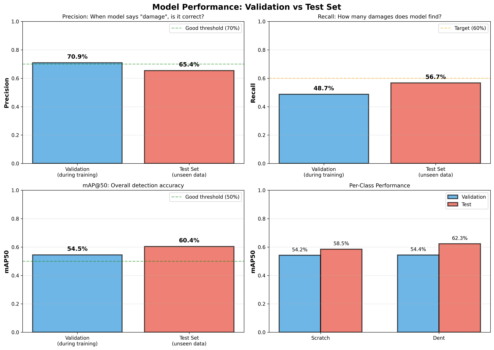
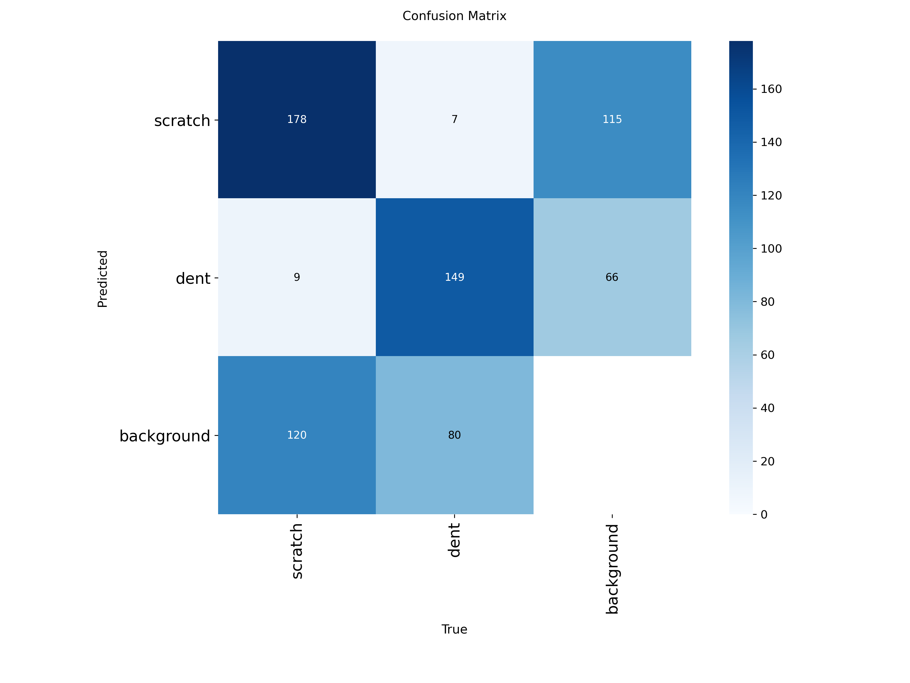
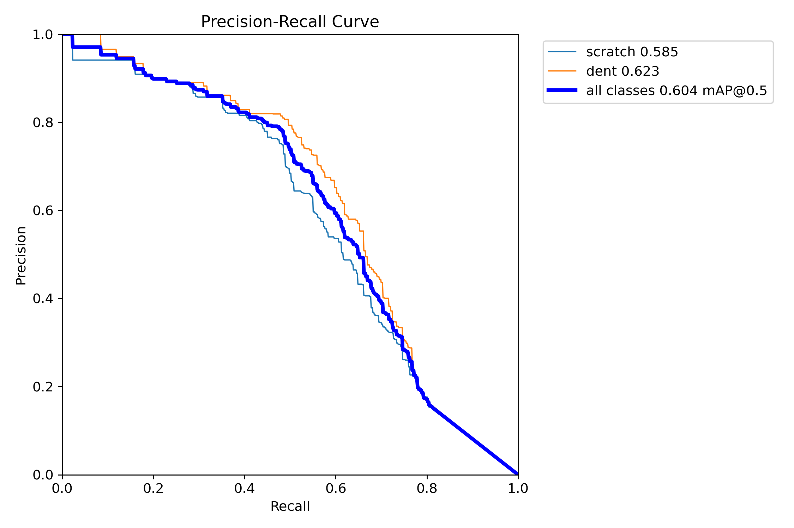
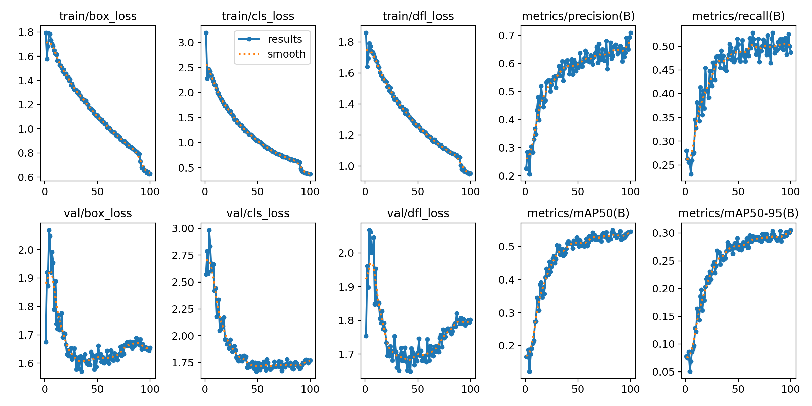
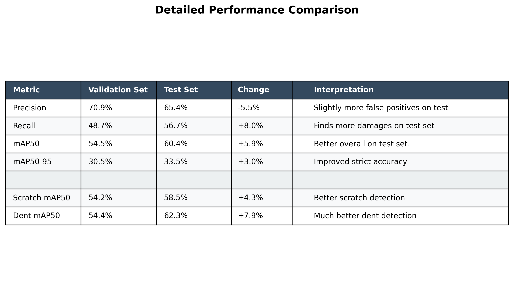

# 🚗 Car Damage Detection System

**AI-powered system for automated detection of scratches and dents on rental cars using YOLOv8**

[](https://www.python.org/downloads/)
[](https://pytorch.org/)
[](https://github.com/ultralytics/ultralytics)
[](LICENSE)

---

## 📋 Overview

This project implements a **deep learning-based object detection system** to automatically identify and localize vehicle damage (scratches and dents) for rental car inspection workflows. Built using **YOLOv8** and trained on the **CarDD dataset**, the system achieves **60.4% mAP50** on unseen test data.

### **Key Features**
- ✅ Real-time damage detection (scratches & dents)
- ✅ GPU-accelerated inference (~5ms per image)
- ✅ Transfer learning from pretrained YOLOv8
- ✅ Comprehensive evaluation metrics & visualizations
- ✅ Production-ready model (22MB)
- ✅ Easy-to-use inference API

---

## 🎯 Performance Metrics

| Metric | Value | Description |
|--------|-------|-------------|
| **mAP50** | 60.4% | Overall detection accuracy at 50% IoU |
| **Precision** | 65.4% | Accuracy of positive detections |
| **Recall** | 56.7% | Percentage of damages found |
| **mAP50-95** | 33.5% | Strict accuracy across IoU thresholds |
| **Inference Speed** | ~5ms | Per image on RTX 3060 |

### **Performance Comparison**



*Validation vs Test set performance across key metrics*

---

## 📊 Results & Visualizations

### **Sample Predictions**


*Yellow boxes = Model predictions | Blue boxes = Scratches | Cyan boxes = Dents*

**Note**: Showing only test images containing scratches and dents (270 out of 374 test images, 72.2%)

### **Confusion Matrix**



*Detection breakdown: Scratches (178 correct, 115 missed) | Dents (149 correct, 66 missed)*

### **Precision-Recall Curve**



*Trade-off between precision and recall at different confidence thresholds*

### **Training Progress**



*Loss curves and metrics over 100 training epochs*

---

## 🏗️ Architecture

### **Model Details**
- **Base Model**: YOLOv8s (Small)
- **Input Resolution**: 640×640 pixels
- **Output Classes**: 2 (scratch, dent)
- **Parameters**: 11.1M
- **Model Size**: 22 MB

### **Transfer Learning Approach**
1. **Pretrained Backbone**: Trained on COCO dataset (1.2M images)
2. **Feature Extraction**: Reuse learned edge/texture detection
3. **Custom Head**: Fine-tuned for car damage detection
4. **Training Data**: 2,816 car damage images

---

## 🗂️ Project Structure

```
car-damage-detection/
├── models/
│   ├── pretrained/        # YOLOv8 base models
│   └── trained/           # Trained model (excluded from repo)
├── scripts/
│   ├── train_model.py     # Training script
│   ├── evaluate_model.py  # Evaluation script
│   ├── inference.py       # Detection script
│   └── visualize_results.py  # Visualization tools
├── results/
│   ├── training/          # Training curves & logs
│   ├── evaluation/        # Test set results
│   └── visualizations/    # Plots & reports
├── docs/                  # Detailed documentation
├── requirements.txt       # Python dependencies
└── README.md             # This file
```

> **Note**: Datasets and trained models are excluded from this repository due to size. See [Setup](#-setup) for download instructions.

---

## 🚀 Quick Start

### **Prerequisites**
- Python 3.8+
- CUDA-capable GPU (recommended)
- 8GB+ RAM

### **Installation**

```bash
# Clone repository
git clone https://github.com/yourusername/car-damage-detection.git
cd car-damage-detection

# Create virtual environment
python -m venv venv
source venv/bin/activate  # Linux/Mac
venv\Scripts\activate     # Windows

# Install dependencies
pip install -r requirements.txt
```

### **Download Trained Model**

Due to GitHub file size limits, download the trained model separately:

```bash
# Option 1: Download from releases
# Visit: https://github.com/yourusername/car-damage-detection/releases

# Option 2: Train your own model (see Training section)
```

### **Run Detection**

```python
from ultralytics import YOLO

# Load trained model
model = YOLO('models/trained/best.pt')

# Run detection
results = model('path/to/car_image.jpg', conf=0.25)

# Display results
results[0].show()

# Save annotated image
results[0].save('output.jpg')
```

---

## 💻 Usage Examples

### **Basic Detection**

```python
from ultralytics import YOLO

model = YOLO('models/trained/best.pt')
results = model('car.jpg')

# Get detections
for result in results:
    boxes = result.boxes
    for box in boxes:
        class_name = result.names[int(box.cls)]
        confidence = float(box.conf)
        x1, y1, x2, y2 = box.xyxy[0].tolist()
        print(f"{class_name}: {confidence:.2f} at [{x1:.0f}, {y1:.0f}, {x2:.0f}, {y2:.0f}]")
```

### **Batch Processing**

```python
import glob

# Process folder of images
image_paths = glob.glob('car_photos/*.jpg')
results = model(image_paths, conf=0.25)

# Save all results
for i, result in enumerate(results):
    result.save(f'output/result_{i}.jpg')
```

### **Adjusting Sensitivity**

```python
# Lower threshold = more detections (higher recall)
results = model('car.jpg', conf=0.15)  # More sensitive

# Higher threshold = fewer detections (higher precision)
results = model('car.jpg', conf=0.35)  # Less sensitive
```

### **Using the CLI**

```bash
# Run inference script
python scripts/inference.py --image car.jpg --conf 0.25

# Batch process folder
python scripts/inference.py --source car_photos/ --conf 0.25

# Evaluate on test set
python scripts/evaluate_model.py
```

---

## 🎓 Training

### **Dataset**

The model was trained on the [CarDD (Car Damage Detection) dataset](https://arxiv.org/abs/1902.07770):
- **Total Images**: 4,000
- **Split**: Train (2,816) | Val (810) | Test (374)
- **Annotations**: 6,211 damage instances
- **Classes**: Scratch, Dent

> **Note**: Dataset not included in this repository. Download from [CarDD website](https://cardd-ustc.github.io/).

### **Training Configuration**

```bash
# Train model
python scripts/train_model.py

# Training parameters
epochs: 100
batch_size: 16
learning_rate: 0.01
optimizer: SGD
device: CUDA (NVIDIA RTX 3060)
training_time: ~4 hours
```

### **Training Script**

```python
from ultralytics import YOLO

# Load pretrained model
model = YOLO('yolov8s.pt')

# Train on custom data
results = model.train(
    data='data/CarDD_YOLO/data.yaml',
    epochs=100,
    imgsz=640,
    batch=16,
    device=0  # GPU
)
```

---

## 📈 Detailed Results

### **Per-Class Performance**

| Class | Precision | Recall | mAP50 | F1-Score |
|-------|-----------|--------|-------|----------|
| Scratch | 63.3% | 54.7% | 58.5% | 0.58 |
| Dent | 67.4% | 58.7% | 62.3% | 0.63 |
| **Overall** | **65.4%** | **56.7%** | **60.4%** | **0.61** |

### **Performance Metrics Table**



### **Real-World Interpretation**

```
For every 10 damaged cars:
✅ Will detect damage on ~6 cars
❌ Will miss damage on ~4 cars
⚠️ ~3 false alarms per 10 detections

Recommendation: Use as first-pass screening + manual verification
```

---

## 💡 Use Cases

### **Rental Car Industry**

1. **Pre-Rental Inspection**
   - Document existing damage
   - Generate damage reports
   - Prevent false claims

2. **Post-Rental Inspection**
   - Identify new damage
   - Compare before/after photos
   - Automated billing

3. **Fleet Management**
   - Regular damage monitoring
   - Maintenance scheduling
   - Cost analysis

### **Recommended Workflow**

```
1. Capture images (before rental)
   ├─ Multiple angles
   ├─ Good lighting
   └─ Focus on damage-prone areas

2. Run automated detection
   ├─ confidence=0.25 (balanced)
   └─ Save detection report

3. Manual verification
   ├─ Review flagged areas
   └─ Confirm detections

4. Repeat after rental
   └─ Compare reports to identify new damage
```

---

## 🔧 Configuration

### **Confidence Thresholds**

Adjust based on your use case:

| Scenario | Threshold | Trade-off |
|----------|-----------|-----------|
| **Catch all damages** | 0.15 | Higher recall, more false positives |
| **Balanced** | 0.25 | Default, good balance |
| **High confidence only** | 0.35 | Lower recall, fewer false positives |

### **Model Selection**

| Model | Size | Speed | Accuracy | Use Case |
|-------|------|-------|----------|----------|
| YOLOv8n | 6MB | Fastest | Lower | CPU/Mobile |
| YOLOv8s | 22MB | Fast | Good | **Recommended** |
| YOLOv8m | 50MB | Medium | Better | High accuracy needed |
| YOLOv8l | 87MB | Slower | Best | Maximum accuracy |

---

## 📚 Documentation

Detailed documentation available in `docs/` folder:

- **[PROJECT_OVERVIEW.md](docs/PROJECT_OVERVIEW.md)**: Complete project documentation
- **[TRAINING_GUIDE.md](docs/TRAINING_GUIDE.md)**: Step-by-step training instructions
- **[TRANSFER_LEARNING_EXPLAINED.md](docs/TRANSFER_LEARNING_EXPLAINED.md)**: Transfer learning concepts
- **[LOSS_AND_OPTIMIZER_EXPLAINED.md](docs/LOSS_AND_OPTIMIZER_EXPLAINED.md)**: Technical deep dive

---

## 🛠️ Requirements

### **System Requirements**
- **OS**: Windows, Linux, or macOS
- **Python**: 3.8 or higher
- **GPU**: CUDA-capable NVIDIA GPU (recommended)
- **RAM**: 8GB minimum, 16GB recommended
- **Storage**: 50GB for dataset + models

### **Python Dependencies**

```txt
numpy
torch==2.5.1+cu121
torchvision==0.20.1+cu121
matplotlib
Pillow
pycocotools
opencv-python
ultralytics
```

Install with:
```bash
pip install -r requirements.txt
```

---

## 🚧 Limitations & Future Work

### **Current Limitations**

- ⚠️ Moderate recall (56.7%) - misses ~43% of damages
- ⚠️ Trained only on 2 classes (scratch, dent)
- ⚠️ Dataset limited to specific car types
- ⚠️ Performance varies with lighting/angles

### **Future Improvements**

- [ ] Train on larger dataset
- [ ] Add more damage classes (cracks, glass damage, etc.)
- [ ] Improve recall through ensemble methods
- [ ] Implement damage severity classification
- [ ] Add damage area measurement
- [ ] Mobile app integration
- [ ] Before/after comparison system
- [ ] Real-time video processing

---

## 📖 Citation

If you use this project in your research or work, please cite:

```bibtex
@misc{car-damage-detection-2026,
  author = {Your Name},
  title = {Car Damage Detection using YOLOv8},
  year = {2026},
  url = {https://github.com/yourusername/car-damage-detection}
}
```

**CarDD Dataset**:
```bibtex
@article{wang2019cardd,
  title={CarDD: A New Dataset for Vision-based Car Damage Detection},
  author={Wang, Xinkuang and Chen, Zhengxing and Wu, Qian and Wang, Zuoxin},
  journal={arXiv preprint arXiv:1902.07770},
  year={2019}
}
```

---

## 📄 License

This project is available for **educational and research purposes**.

- **Code**: MIT License
- **YOLOv8**: AGPL-3.0 License ([Ultralytics](https://github.com/ultralytics/ultralytics))
- **CarDD Dataset**: Research use only

---

## 🤝 Contributing

Contributions are welcome! Please feel free to:

1. Fork the repository
2. Create a feature branch (`git checkout -b feature/amazing-feature`)
3. Commit your changes (`git commit -m 'Add amazing feature'`)
4. Push to the branch (`git push origin feature/amazing-feature`)
5. Open a Pull Request

---

## 💬 Contact & Support

- **Issues**: [GitHub Issues](https://github.com/yourusername/car-damage-detection/issues)
- **Discussions**: [GitHub Discussions](https://github.com/yourusername/car-damage-detection/discussions)

---

## 🙏 Acknowledgments

- **Ultralytics** for the amazing YOLOv8 framework
- **CarDD Dataset** authors for the comprehensive car damage dataset
- **PyTorch** team for the deep learning framework
- **NVIDIA** for CUDA and GPU acceleration

---

## 📊 Project Stats


---

<div align="center">

**⭐ If you find this project useful, please consider giving it a star! ⭐**

**Built with ❤️ using YOLOv8 and PyTorch**

</div>
